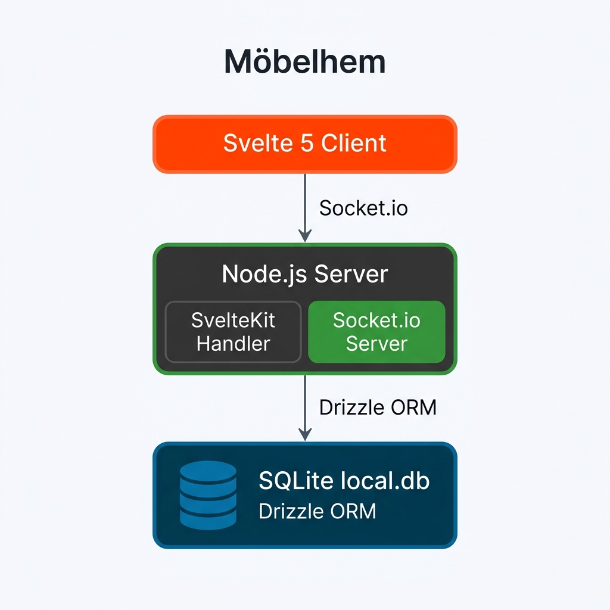

<!-- speaker_note: |
  Bonjour à tous. Aujourd'hui, nous allons vous présenter les coulisses techniques de notre projet libre de cette fin de semestre, un jeu de quiz multijoueur en temps réel où le but est de deviner si un nom désigne un meuble IKEA, une ville ou région scandinave, ou les deux à la fois.

  Pour ce projet, nous avons fait des choix technologiques bien précis pour allier réactivité de l'interface client, communication temps réel bidirectionnelle et persistance efficace des données. C'était surtout pour nous l'opportunité de sortir des sentiers battus et de tester des technologies modernes et assez originales, qui nous changent des frameworks plus traditionnels que nous utilisons habituellement dans notre cadre professionnel, comme Angular ou React.

  L'objectif de cette présentation est de vous faire découvrir notre stack technique, pourquoi nous avons choisi chaque outil et ce que nous avons appris en chemin.

  Je vais commencer par vous présenter brièvement l'architecture globale de notre projet,

  nous terminerons par une démo et vous pourrez nous poser toutes vos questions à la fin.
-->

# L'architecture globale

<!-- alignment: center -->

<!-- speaker_note: |
    Regardons d'abord la vue d'ensemble. Möbelhem repose sur une architecture client-serveur monolithique classique mais avec une claire séparation des responsabilités :
  - Côté client : L'interface est gérée par Svelte 5, qui communique avec le serveur via HTTP pour les pages classiques et les requêtes initiales, et via WebSockets (Socket.io) pour les sessions multijoueurs. Colin reviendra plus en détails sur le frontend.
  - Côté serveur : Nous utilisons un serveur Node.js personnalisé (défini dans server.ts). Ce serveur enveloppe le "handler" généré par SvelteKit (via l'adaptateur Node) et instancie un serveur Socket.io sur le même port HTTP. Quentin vous parlera un peu plus du backend.
  - Côté base de données : Un fichier SQLite local géré via l'ORM Drizzle. Pour les besoins de ce projet il nous semblait suffisant d'utiliser une DB SQLite afin de ne pas perdre de temps là-dessus. Louis vous expliquera comment nous avons peuplé cette DB.
-->

<!-- end_slide -->

# Svelte 5 & SvelteKit

<!-- jump_to_middle -->
<!-- column_layout: [1, 2, 1] -->
<!-- column: 1 -->

- **Frontend réactif**
<!-- new_line -->
- **Runes :** `$state`, `$derived`, `$effect`

<!-- reset_layout -->

<!-- end_slide -->

# Socket.io

<!-- jump_to_middle -->
<!-- column_layout: [1, 2, 1] -->
<!-- column: 1 -->

- **Temps réel bidirectionnel**
<!-- new_line -->
- **WebSocket & long-polling fallbacks**
<!-- new_line -->
- **Gestion de salons (rooms)**

<!-- reset_layout -->

<!-- end_slide -->

# Drizzle ORM & SQLite

<!-- jump_to_middle -->
<!-- column_layout: [1, 2, 1] -->
<!-- column: 1 -->

- **Persistance légère**
<!-- new_line -->
- **better-sqlite3 (driver synchrone)**
<!-- new_line -->
- **TypeScript-first**

<!-- reset_layout -->

<!-- end_slide -->

# Tailwind CSS v4

<!-- jump_to_middle -->
<!-- column_layout: [1, 2, 1] -->
<!-- column: 1 -->

- **Rust compiler (Oxide)**
<!-- new_line -->
- **CSS-first configuration**
<!-- new_line -->
- **Intégration Vite native**

<!-- reset_layout -->

<!-- end_slide -->

# Playwright & Vitest

<!-- jump_to_middle -->
<!-- column_layout: [1, 2, 1] -->
<!-- column: 1 -->

- **Tests unitaires rapides (Vitest)**
<!-- new_line -->
- **Tests E2E multi-navigateurs (Playwright)**
<!-- new_line -->
- **Isolation des contextes**

<!-- reset_layout -->

<!-- end_slide -->

# Couverture des tests

<!-- jump_to_middle -->
<!-- column_layout: [1, 2, 1] -->
<!-- column: 1 -->

- **Couverture globale : > 94%** (lignes et instructions)
<!-- new_line -->
- **Composants UI : ~91%** de couverture
<!-- new_line -->
- **Logique serveur & utilitaires : 96% à 100%** de couverture

<!-- reset_layout -->

<!-- speaker_note: |
  Pour valider la qualité et la robustesse de notre codebase, nous avons mis en place une mesure de couverture de code rigoureuse.

  Les résultats sont extrêmement satisfaisants :
  - Nous atteignons plus de 94 % de couverture globale sur l'ensemble du projet.
  - Les composants d'interface utilisateur (comme le bouton, la carte, la liste des joueurs ou la barre de temps) tournent autour de 91 % de couverture.
  - La logique du serveur de jeu (le RoomManager, le calcul des scores) ainsi que tous nos fichiers utilitaires sont couverts entre 96 % et 100 %.

  Cette couverture élevée nous donne une grande confiance dans le code, en limitant les régressions visuelles et fonctionnelles à chaque modification.
-->

<!-- end_slide -->

# Place à la démo !

<!-- alignment: center -->
<!-- jump_to_middle -->

## 🎮 Démo en direct

<!-- new_line -->

Lancement d'une partie de Möbelhem.

<!-- speaker_note: |
  Maintenant que nous avons fait le tour de l'architecture et de la théorie, passons à la pratique.

  Je vous propose de lancer une démo en direct de Möbelhem pour voir comment tout cela fonctionne. Nous allons créer une partie multijoueurs, faire rejoindre un deuxième joueur, et lancer le quiz.
-->

<!-- end_slide -->

# Conclusion

<!-- jump_to_middle -->
<!-- column_layout: [1, 2, 1] -->
<!-- column: 1 -->

- **Terrain d'expérimentations**
<!-- new_line -->
- **Succès techniques (Svelte 5, Sockets, Drizzle)**
<!-- new_line -->
- **Échecs formateurs (Radicle vs GitHub)**

<!-- reset_layout -->

<!-- speaker_note: |
  En conclusion, ce projet libre de fin de semestre a surtout été pour notre équipe un formidable terrain d'expérimentation et d'apprentissage, l'occasion idéale de sortir de notre zone de confort technique.

  Certaines expérimentations ont été de francs succès :
  - L'intégration de Svelte 5 et de son nouveau modèle de Runes réactives.
  - La conception du backend temps réel résilient avec Socket.io.
  - L'implémentation de la persistance ultra-légère avec Drizzle ORM et SQLite.

  D'autres essais ont été moins fructueux, mais tout aussi riches d'enseignements. Par exemple, avoir tenté d'utiliser Radicle à la place de GitHub. Après pas mal de temps perdu à essayer de configurer les nœuds et de stabiliser le workflow de synchronisation collaboratif, nous avons dû admettre que ce n'était pas encore mûr pour notre usage et nous sommes revenus sur GitHub.

  C'est le propre d'un projet académique libre : tester de nouvelles choses, commettre des erreurs, apprendre à mesurer les coûts/bénéfices et savoir pivoter rapidement quand c'est nécessaire.

  Merci pour votre attention, et nous sommes désormais ouverts à toutes vos questions !
-->
